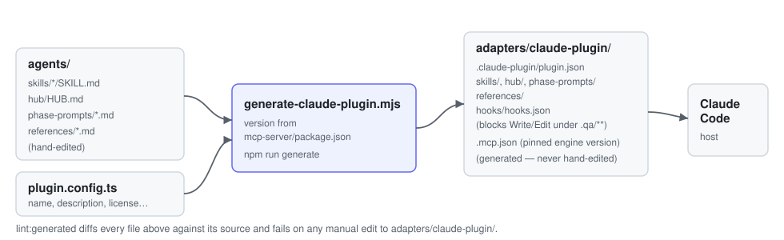
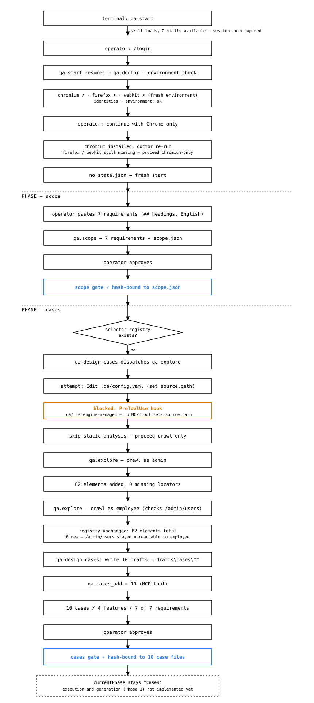

# QA-AI-STLC

Open-source, model-agnostic QA framework that runs inside the agent host you already use: Claude Code or Codex.

> **Status: pre-alpha.** The engine packages (`schemas`, `core`, `explorer`, `cli`, `mcp-server`) are
> published to npm and covered by tests. `qa explore` runs end to end — crawl, static source
> analysis, locator synthesis, selector registry, stale-selector detection — against a real running
> application (see the example below). Requirements, test cases and hash-bound approval gates
> (`qa scope`, `qa cases add`, `qa approve`, `qa validate`) work end to end too, with the same core
> logic exposed as MCP tools (`qa-mcp-server`) for any MCP-capable agent host. Every test case now
> carries an explicit `feature` (its artifact lives under that feature's own folder) and can
> reference a reusable, non-secret test-data set instead of inlining repeated values. `qa run` runs
> a hand-written Playwright spec and records every result under `.qa/runs/<run-id>/`, including an
> honest `partial` status when execution did not reach every declared step, plus a screenshot and a
> trace captured for every failure and registered as hashed, secret-scanned evidence; auto-generating
> specs from cases has not started yet. `qa report` renders that run's summary and the requirement →
> case → result → evidence traceability matrix as Markdown or HTML. The agent layer (`qa-start`,
> `qa-explore`, `qa-design-cases`) and
> a generated Claude Code plugin
> (`adapters/claude-plugin/`, see [below](#claude-code-plugin)) both exist, including the
> plugin/engine version handshake. Installing it from a local marketplace is verified by an
> automated Windows/macOS CI smoke test (P2-13), and this repository is itself a real, installable
> marketplace — see the [roadmap](docs/public/ROADMAP.md).

## Why

QA work with AI agents today mostly means chatting with a model in a loop: it clicks around, writes a test, tells you it passed. There's no artifact you can trust without re-checking it yourself, no record of what was actually clicked or called, and no way to tell "the agent verified this" from "the agent said this." Every project starts over — no shared selector map, no traceability from requirement to evidence, no memory between runs.

QA-AI-STLC turns that into a deterministic pipeline instead of a conversation. The agent drives it, but the engine — not the model — owns the browser, the test runs, the evidence, and every report. A test isn't "kept" until it has actually executed. A defect draft isn't written by hand. Nothing is marked passed unless the engine, not the agent's word, says so. And because it runs inside the agent host you already have, on your own subscription, there's no separate service to trust, host, or pay for.

## What it does

A deterministic TypeScript engine does the work that must be reliable. A thin layer of skills lets the agent in your host drive it. This project is pre-alpha (see the status note above): the table below is the actual boundary between what runs today and what is still planned — don't take a capability as shipped just because it's described here.

| Capability                                                                                                                                                                                                                                                                                                                                         | Status                                                | Notes                                                                                                                                                                                                                                                                              |
| -------------------------------------------------------------------------------------------------------------------------------------------------------------------------------------------------------------------------------------------------------------------------------------------------------------------------------------------------- | ----------------------------------------------------- | ---------------------------------------------------------------------------------------------------------------------------------------------------------------------------------------------------------------------------------------------------------------------------------- |
| **Asks what is in scope** for the project: Web E2E, API, accessibility and security testing are each decided by you, and the pipeline enforces the answer.                                                                                                                                                                                         | Available                                             |                                                                                                                                                                                                                                                                                    |
| **Explores your application** and builds a stable selector registry and an API-surface map before any test is written.                                                                                                                                                                                                                             | Available                                             |                                                                                                                                                                                                                                                                                    |
| **Extracts requirements** from a local Markdown source and keeps them in `artifacts/scope.json`, never from a tracker or wiki.                                                                                                                                                                                                                     | Available                                             |                                                                                                                                                                                                                                                                                    |
| **Designs test cases** with the agent in your host, each one required to link back to a real requirement — a link to something that doesn't exist is rejected, not silently accepted. Every case declares a `feature` (its own artifact folder) and can reference a reusable, non-secret test-data set instead of duplicating values across cases. | Available                                             |                                                                                                                                                                                                                                                                                    |
| **Gates every phase behind a hash-bound approval**: an artifact's exact content, not just its existence, is what gets approved, so editing it afterward reopens the gate automatically.                                                                                                                                                            | Available                                             | Currently `scope` and `cases`; later phases add their own gates as they ship.                                                                                                                                                                                                      |
| **Generates Playwright tests**, for the UI and for the API from your OpenAPI contract, that are verified by execution before they are kept and run in CI without any model.                                                                                                                                                                        | Planned                                               | Phase 3; the generation contract, its verification loop and the `qa-generate-tests` skill's engine support (recovering a proven `qa-execute` session's steps from evidence, `qa.generation_proven_session`) are built, but the skill has not generated a real spec end to end yet. |
| **Runs a spec set and records the result** (`qa run` / `qa.run`), honestly reporting a case as `partial`, not `passed` or `failed`, if its execution did not reach every declared step.                                                                                                                                                            | Available                                             | Phase 3; only `e2e` (Playwright) has a runner so far — `api`/`a11y` are Phase 6. Runs a hand-written spec today; generated specs depend on the row above.                                                                                                                          |
| **Records evidence** (a screenshot and a trace, captured on failure and registered through the same hashed, secret-scanned evidence store as every other engine-owned action) that only the engine can create, so results cannot be invented.                                                                                                      | Available                                             | Phase 3; a `failed` result with no registered evidence fails the run rather than persisting an unbacked failure. Redacted network-data capture is not wired in yet.                                                                                                                |
| **Renders reports** (`qa report` / `qa.report`): a run summary and the requirement → case → result → evidence traceability matrix, as Markdown or HTML, from canonical JSON already recorded under `.qa/` — no hand-written report path exists.                                                                                                    | Available                                             | Phase 3. `qa link <spec> <requirement-id> --feature <name>` / `qa.link` folds an already-existing, hand-written spec into the matrix without regeneration.                                                                                                                         |
| **Prepares defect drafts** in a tracker-neutral format for you to file, and a root cause analysis for every defect you accept.                                                                                                                                                                                                                     | Planned                                               | Phase 6.                                                                                                                                                                                                                                                                           |
| **Runs a security audit on demand**: non-destructive checks against the running application, and code-assisted checks when you point it at the source.                                                                                                                                                                                             | Planned                                               | Phase 6; no `runner-security` package exists yet.                                                                                                                                                                                                                                  |
| **Exposes every one of the above as an MCP tool** (`qa-mcp-server`, local, stdio, no Docker, no hosted service) so any MCP-capable agent host can drive the exact same engine logic the CLI does.                                                                                                                                                  | Available for the capabilities marked Available above | MCP coverage tracks engine coverage — a planned capability has no MCP tool yet either.                                                                                                                                                                                             |

See the [roadmap](docs/public/ROADMAP.md) for phase-by-phase detail on what "Planned" covers.

## Supported hosts

| Host                          | Status                                                                                                                |
| ----------------------------- | --------------------------------------------------------------------------------------------------------------------- |
| Claude Code (CLI and desktop) | Installable from this repository as a public marketplace, or from a local marketplace (verified on Windows and macOS) |
| Codex (CLI and desktop)       | Planned                                                                                                               |
| Other MCP-capable hosts       | Engine usable through the local MCP server                                                                            |

## Responsibility boundary

Read this before adopting the framework.

**The model is yours.** The framework runs entirely on your machine inside your agent host and uses the model and subscription you have configured there. It operates no hosted service, requires no API keys and never calls a language model itself. Model usage and its cost are governed by your host account.

**Defects and reports are yours to publish.** Creating, filing and publishing defects, test reports and any other records in external systems such as Jira, Confluence, GitHub Issues, Azure DevOps or TestRail is the responsibility of the operator and the operator's infrastructure. The framework contains no integrations with such systems, stores no tracker credentials and sends nothing to them. It produces schema-valid defect drafts and rendered reports in your project that you can file, script or import with your own tools.

**Decisions are yours.** Test scope, test cases, defect acceptance and release recommendations require explicit operator approval. The framework records evidence; it does not certify quality.

**Environments are yours to choose.** Point the framework only at non-production environments you are authorized to test. Safe mode is on by default, but you remain responsible for the data and systems it touches.

## Quick start

```sh
npx @qa-ai-stlc/cli init --e2e in-scope --api out-of-scope --a11y out-of-scope --security out-of-scope
npx @qa-ai-stlc/cli doctor
```

`qa init` runs a short scope survey — each of Web E2E, API, accessibility and security testing is
answered `in-scope`, `out-of-scope` or (with `--defer-scope`) left `undecided` for later. Passing
the answers as flags, as above, skips the interactive prompts; change a decision later with
`qa config set testing.<type> <value>`. `qa doctor` checks Node, installed browsers, identities and
environment reachability.


Recorded from a real run against [`examples/demo-app`](examples/demo-app): `qa init`, then `qa config
add` for an environment and identity, then `qa explore` building a 78-element selector registry, then
a teammate renaming a `data-testid` on the live page, then `qa explore --verify` catching it and
exiting non-zero. Waiting time between commands is sped up; every command and every line of output is
real.

Add an environment and an identity — validated against the schema, no hand-editing `.qa/config.yaml` — then explore it:

```sh
npx @qa-ai-stlc/cli config add environment staging \
  --base-url https://staging.example.com/dashboard --allowlist staging.example.com
npx @qa-ai-stlc/cli config add identity admin \
  --auth storage-state --secret QA_ADMIN_PASSWORD \
  --login-url https://staging.example.com/login --username admin@example.com
npx @qa-ai-stlc/cli explore --environment staging --identity admin
```

This is the actual output of that command against [`examples/demo-app`](examples/demo-app), a
small task tracker used to validate the explorer against a real, running application:

```
Wrote selectors/registry.json: 78 element(s) (78 added, 0 removed, 0 degraded).
0 element(s) with no locator candidate.
0 non-GET request(s) blocked by safe mode.
```

`--json` gives the same result as data instead of text:

```json
{
  "command": "explore",
  "data": {
    "mode": "explore",
    "registryPath": "selectors/registry.json",
    "elementCount": 78,
    "added": 78,
    "removed": 0,
    "degraded": [],
    "missingLocatorCount": 0,
    "blockedRequestCount": 0
  }
}
```

Everything the framework creates lives in `.qa/`, plus a generated locator module in
`tests/qa/locators.ts`. A couple of real entries from each, unedited:

```json
{
  "elementId": "0c39ce7809e90e508adfaa7caaab21befc7adbacf20bf7b87facd333326c0861",
  "name": "dashboard",
  "kind": "link",
  "locatorCandidates": [
    { "strategy": "role", "value": "{\"role\":\"link\",\"name\":\"Dashboard\"}", "fragile": false },
    { "strategy": "text", "value": "Dashboard", "fragile": false },
    { "strategy": "css", "value": "a:nth-of-type(1)", "fragile": true }
  ],
  "stabilityScore": 1,
  "source": "crawl",
  "pageUrl": "http://localhost:4310/dashboard"
}
```

```ts
export function apply(page: Page): Locator {
  return page.getByTestId('apply-filter');
}
```

Generated tests reference locators through this module by name (`apply(page)`), never through a
literal selector, so a selector change is a one-line diff here instead of a search-and-replace
across every test file.

### Catching a stale selector

`qa explore --verify` re-checks every stored primary candidate against the live page, without
re-crawling — the only way to actually notice a selector that used to work and no longer does. With
`examples/demo-app`'s "Apply" filter button renamed from `data-testid="apply-filter"` to
`apply-filter-renamed` on the live page but not yet re-crawled:

```
Verified selectors/registry.json: 78 element(s) checked.
1 degraded selector(s):
  e4fdfc0102d95678698c91fff17367185e23560634c6d531cf896bdcf554f65b: 1 -> 0
```

The exit code is non-zero, so this is a real CI gate: a rename ships broken tests only if nobody
looks, and `--verify` catches it before that happens.

### Static source analysis

`qa explore --static` (with `source.path` set in `config.yaml`) merges a lightweight scan of your
source into the same registry — elements a crawl alone would miss, and every field with no
`data-testid`, `aria-label` or `role` to name it, recorded in
`.qa/selectors/missing-test-ids.json` with its file and line. Against the same demo app's real,
unmodified views: 26 of its 105 elements have no locator candidate at all — a login form and a
"new task" form, neither with a `data-testid` on any field, a deliberately catalogued gap.

Static route extraction is also available as a library function ahead of its own CLI flag (see the
[roadmap](docs/public/ROADMAP.md)) — React Router, Vue Router and Angular route configs, with file
and line:

```ts
import { analyzeStaticRoutes } from '@qa-ai-stlc/explorer';

const { routes } = analyzeStaticRoutes({
  files: [
    {
      filePath: 'src/App.tsx',
      content:
        '<Routes>\n  <Route path="/dashboard" element={<Dashboard />}>\n    <Route path="/dashboard/tasks" element={<Tasks />} />\n  </Route>\n</Routes>',
    },
  ],
});
```

```json
[
  { "path": "/dashboard", "filePath": "src/App.tsx", "line": 2 },
  { "path": "/dashboard/tasks", "filePath": "src/App.tsx", "line": 3 }
]
```

### Pick mode

When a crawl can't reach an element (behind a multi-step flow, a modal, a canvas widget), record it
by hand instead: `qa explore --pick <url>` opens the page, lets you click the element, and writes a
registry entry with `"source": "manual"` — same schema, same downstream locator generation, honestly
labelled as not crawler-discovered:

```json
{ "elementId": "element-1", "source": "manual", "pii": false, "dynamicText": false }
```

## Requirements, test cases and gates

Independent of the registry above, extract requirements from a local Markdown file — one
`## Heading` per requirement — and register test cases against them:

```sh
npx @qa-ai-stlc/cli scope --from file --path requirements.md
npx @qa-ai-stlc/cli cases add --path cases/login.json
npx @qa-ai-stlc/cli approve scope --artifact artifacts/scope.json --approved-by operator
npx @qa-ai-stlc/cli validate
```


Recorded from a real run: `qa scope` extracts two requirements from a Markdown file; `qa cases add`
registers a case linked to a real requirement, then rejects a second case whose `requirementIds`
names a requirement that was never scoped in; `qa approve scope` hash-binds the approval to
`scope.json`'s exact content; `qa validate` reports a clean pipeline — then, after a teammate edits
`scope.json` by hand to remove the requirement the first case relied on, `qa validate` catches both
the reopened gate and the now-unlinked case in the same run. Waiting time between commands is sped
up; every command and every line of output is real.

A case is rejected up front if any `requirementIds` entry does not resolve in `artifacts/scope.json`:

```
error: Case "reset-password-case" links to requirement(s) not in artifacts/scope.json: reset-password
Run "qa scope" to register the requirement first, or fix the case's requirementIds.
```

`qa approve <gate> --artifact <path> --approved-by <name>` hashes the artifact's exact content into
an append-only ledger (ADR-003). `qa validate` recomputes every gate from that ledger — never from a
cached status field — so an edit after approval reopens the gate automatically, and re-sweeps every
registered case's requirement links on every call, catching a link broken later by editing
`scope.json`, not just one broken at `cases add` time:

```
[open] scope (reopened since last approval)
[open] cases
Current phase: scope.
1 unlinked case(s):
  artifacts/cases/login-case.json: login
```

### Local MCP server

`npx @qa-ai-stlc/mcp-server` (bin: `qa-mcp-server`) starts a local server over stdio — the same
process model any MCP-capable agent host already uses for a local tool, no Docker, no port, no
process that outlives the session. It exposes one MCP tool per engine operation above (`qa.doctor`,
`qa.explore`, `qa.scope`, `qa.cases_add`, `qa.approve`, `qa.validate`, `qa.run`, `qa.report`), each calling the exact same
`packages/core`/`packages/explorer` function its CLI command calls, so a result from one is a result
from the other. Manual pick-mode capture (`qa explore --pick <url>`) stays CLI-only: it opens a
headed browser for a human to click through, which nothing can drive over MCP's stdio transport.

## Claude Code plugin

`npm run generate` produces `adapters/claude-plugin/` from two hand-edited sources — `agents/`
(the skills, hub definition, phase prompts and shared references every host generates from) and
`plugin.config.ts` (static metadata: name, description, license) — plus `packages/mcp-server`'s own
`package.json` version, so the plugin's version and the pinned MCP server it launches can never
drift apart. The same command also generates this repository's own root
`.claude-plugin/marketplace.json`, declaring that generated plugin by a path relative to the repo
root — so this public repository is directly installable as a Claude Code marketplace, with no
separate marketplace repository to keep in sync. `npm run lint:generated` (`--check` mode) diffs
every generated file against its source and fails on anything hand-edited directly under
`adapters/claude-plugin/` or `.claude-plugin/marketplace.json`, the same contract already enforced
for `.claude/rules/`.

```sh
claude plugin marketplace add Klim-101/QA-AI-STLC
claude plugin install qa-ai-stlc@qa-ai-stlc
```

This is real output from that exact install, against the real public repository, not a local copy:

```
Adding marketplace…SSH not configured, cloning via HTTPS: https://github.com/Klim-101/QA-AI-STLC.git
Refreshing marketplace cache (timeout: 120s)…
Cloning repository (timeout: 120s): https://github.com/Klim-101/QA-AI-STLC.git
Clone complete, validating marketplace…
✔ Successfully added marketplace: qa-ai-stlc (declared in local settings)
Installing plugin "qa-ai-stlc@qa-ai-stlc"...✔ Successfully installed plugin: qa-ai-stlc@qa-ai-stlc (scope: local)
```

This is a decentralized marketplace — a plain git repository, not a reviewed or centrally listed
one — so there is no install counter or built-in review system to check. If you've installed it,
[Show and tell](https://github.com/Klim-101/QA-AI-STLC/discussions/categories/show-and-tell) is the
place to say how it went; [Discussions](https://github.com/Klim-101/QA-AI-STLC/discussions) in
general is the right place for questions and ideas that aren't a specific bug or feature request.



The plugin/engine version handshake (ADR-007) shipped in P2-12: the generated `.mcp.json` pins the
`mcp-server` version it launches, and the server checks it against the engine's own version at
startup. What the generator produces today: a `.claude-plugin/plugin.json` manifest, the skills
under `skills/` (`qa-start`, `qa-explore`, `qa-design-cases`), a `PreToolUse` hook
(`hooks/hooks.json`) that blocks any `Write`/`Edit` under `.qa/**` — layer 2 of that protection, on
top of the engine's own manifest and hash checks — and an `.mcp.json` that launches
`qa-mcp-server` via `npx -y @qa-ai-stlc/mcp-server@<pinned version>`. Subagent generation is not
part of this yet: it is added once Phase 4 defines real spoke files to generate from. Installing
from a local marketplace with the framework source absent from disk is verified by CI on Windows
and macOS (P2-13); installing directly from this public repository, as above, is verified manually
against the real repo (P2-15) — `claude plugin list --json` afterward shows the installed plugin's
`mcpServers` entry launching `npx -y @qa-ai-stlc/mcp-server@<version>`, matching the version pinned
into the manifest at generate time.

### A real end-to-end session

The plugin installed from a local marketplace this way drives a real Claude Code session against
[`examples/demo-app`](examples/demo-app), with the engine's own MCP tools providing every result —
`qa-start` never invents an answer the engine hasn't returned.



Recorded from a real session: `qa.doctor` on a fresh checkout reports all three Playwright browsers
missing; the operator chooses Chromium-only, and the doctor re-check confirms Firefox/WebKit still
missing before the hub proceeds. `qa-design-cases` finds no selector registry yet, dispatches
`qa-explore`, and its own attempt to hand-edit `config.yaml` (to enable static analysis) is blocked
by the same `PreToolUse` hook shown above — `.qa/` has no back door even for the skill that wants
in — so it falls back to crawl-only exploration. The admin crawl adds 82 elements; the employee
crawl adds **zero** new elements — no link into `/admin/users` is reachable from anywhere the
employee identity's crawl visits. That shows the page is not _discoverable_ under that identity; it
is not a check that access to it is actually blocked. Confirming the role-based-access requirement
itself needs a direct request to `/admin/users` as the employee identity and an assertion on the
response (a 403, a redirect, or an equivalent denial) — a check the pipeline does not yet make on
its own; it belongs to the on-demand security audit (Phase 6), not to exploration. 10 test cases
are registered across `auth`, `access-control`, `dashboard` and `tasks`, covering all 7
requirements, and both the `scope` and `cases` gates are approved. `currentPhase` stays `"cases"`
afterward: the hash-bound gate pipeline still only tracks `scope`/`cases` (v0) — `qa run` (below)
executes and records results independently of it, not as a gated phase of its own yet.

A real requirement from that run's `scope.json`:

```json
{
  "id": "role-based-access",
  "title": "Role-based access",
  "description": "The application supports two roles: admin and employee. The user management section (/admin/users) is accessible only to users with the admin role; an employee must not be able to view the user list.",
  "source": { "kind": "text", "label": "operator-requirements" },
  "inScope": true
}
```

And one of the 10 registered test cases, grounded in real registry locators, not invented ones:

```json
{
  "schemaVersion": 1,
  "id": "login-invalid-credentials",
  "feature": "auth",
  "requirementIds": ["authentication"],
  "testType": "e2e",
  "title": "Invalid credentials show an error and stay on the login page",
  "preconditions": ["The user is on the login page (http://localhost:4310/login)"],
  "steps": [
    { "description": "Enter a registered account's email into the \"Email\" field" },
    { "description": "Enter an incorrect password into the \"Password\" field" },
    { "description": "Click the \"Log in\" button" }
  ],
  "expectedResult": "The login page is redisplayed with the error message \"Invalid email or password.\" shown, and no session is created (the user is not redirected to /dashboard).",
  "regressionTier": "regression",
  "status": "draft",
  "createdAt": "2026-09-24T18:00:00Z"
}
```

That case can now be handed to a stakeholder as a presentable document instead of raw JSON: `qa
cases render login-invalid-credentials` (or the matching `qa.cases_render` MCP tool) renders it
through a reusable JSON-to-Markdown artifact registry (ADR-002) built to take a second artifact
kind, such as defect drafts, once one exists. HTML rendering is still open work. A spec covering
this case can be run and its result recorded with `qa run --spec <path>` (or `qa.run`) — only `e2e`
(Playwright) has a runner so far; auto-generating the spec itself from the case, rather than writing
it by hand, is Phase 3 work that has not started yet (see the roadmap).

## Documentation

- [Roadmap](docs/public/ROADMAP.md): phases, current status, and what is deliberately out of scope.
- [Architecture diagram](docs/public/architecture-diagram.md): how the agent host, the engine and the pipeline state fit together.
- [Architecture decision records](docs/adr/README.md): the significant, hard-to-reverse decisions behind the design, and why.

## Contributing

Contributions are welcome. Read [CONTRIBUTING.md](CONTRIBUTING.md) and follow the [Code of Conduct](CODE_OF_CONDUCT.md).
Questions, ideas and general feedback belong in [Discussions](https://github.com/Klim-101/QA-AI-STLC/discussions); a specific bug or requested feature is still an [issue](https://github.com/Klim-101/QA-AI-STLC/issues/new/choose).

## Security

Do not report vulnerabilities in public issues. See [SECURITY.md](SECURITY.md).

## License

Licensed under the [Apache License, Version 2.0](LICENSE). See [NOTICE](NOTICE).

The software is provided "AS IS", without warranties or conditions of any kind. Claude Code, Codex and Playwright are trademarks of their respective owners; this project is not affiliated with or endorsed by them.
