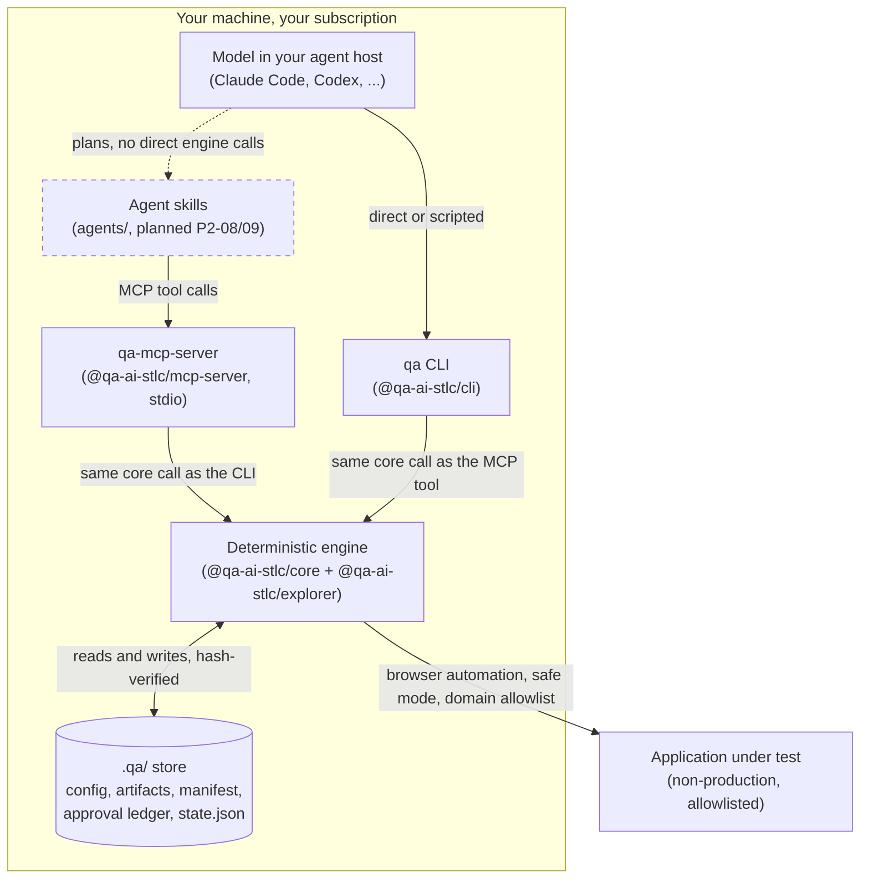
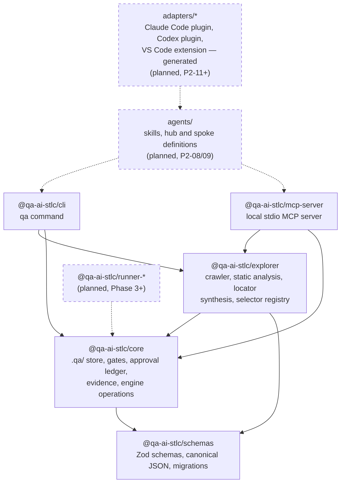
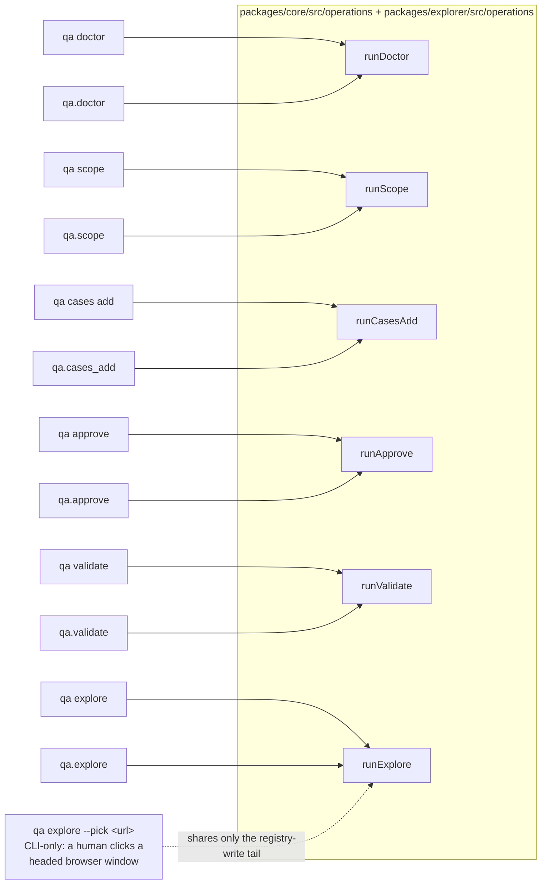
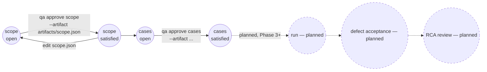

# Architecture diagram

How QA-AI-STLC's pieces fit together: the agent host, the deterministic engine, and the pipeline
state the two agree on. See [AGENTS.md](../../AGENTS.md) section 3 for the authoritative repository
map and section 2 for the non-negotiable boundaries these diagrams illustrate, and the
[architecture decision records](../adr/README.md) for why each boundary is where it is.

Solid boxes and edges exist today (mirrors the [roadmap](ROADMAP.md)'s "done"/"in progress" phases);
dashed ones are planned and not built yet.

## System context

Who calls what, and who owns the browser.

**No model calls in the engine (ADR-001).** The box labelled "Model" is the only place in this
picture that calls an LLM. `core`, `explorer`, `cli` and `mcp-server` depend on no LLM SDK and make
no network call to one — verified in CI by `npm run lint`'s LLM-dependency denylist check.

**The engine owns the browser (ADR-004).** Neither the model nor a skill drives Playwright
directly; every interaction with the application under test goes through an engine tool that
registers evidence, navigates only inside the configured allowlist, and defaults to safe mode (no
form submission, no non-GET request).

**No hosted infrastructure.** Every box above runs on your machine. `qa-mcp-server` is a local
stdio process your agent host spawns like any other local tool — no port, no container, no service
that outlives the session, no third-party MCP server bundled or required.

## Package dependency graph

Dependencies point downward only (AGENTS.md section 3); nothing here has a cycle.

`schemas` depends on nothing internal — every artifact's shape is defined once and imported
everywhere else. `core` and `explorer` are the deterministic engine; `cli` and `mcp-server` are
thin hosts over it, each an entry point into the exact same operations (P2-05): a CLI command and
its MCP tool counterpart call one shared function in `core` or `explorer`, never two
implementations of the same behavior.

## Engine operations, shared by both hosts

`packages/core/src/operations/*.ts` and `packages/explorer/src/operations/explore.ts` are each
called from two places — a CLI command and an MCP tool — through a common `EngineContext`
(filesystem, clock, logger, process runner, HTTP client, browser launcher, environment,
project root) that the CLI and the MCP server each build from their own real adapters.

`report` and a standalone "registry query" have no CLI command yet, so they have no MCP tool yet
either — planned, not silently dropped.

## Pipeline state and gates (ADR-003)

`state.json` is never trusted as cached truth: `qa validate` (and its MCP counterpart) always
recomputes every gate's status from the approval ledger plus each approved artifact's current
content. Approving a phase hashes its artifact's exact content into an append-only ledger; editing
the artifact afterward changes its hash, so the next recompute reports the gate reopened — a
tamper/drift detector, not a checkbox.

Every registered test case must link to at least one requirement (`TestCaseSchema.requirementIds`,
schema-level), and every link must actually resolve in `artifacts/scope.json` (`qa cases add`,
checked once at registration, and `qa validate`, re-checked on every run) — so a requirement
deleted or renamed after a case was written is caught, not silently stale.

## Related documents

- [Roadmap](ROADMAP.md): phases, current status, what is deliberately out of scope.
- [Architecture decision records](../adr/README.md): the significant, hard-to-reverse decisions
  behind these boundaries.
- [README](../../README.md): quick start, real command output, and the animated demos this
  diagram's boxes correspond to.
